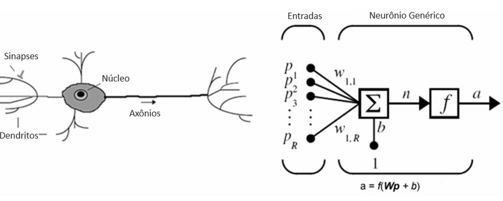
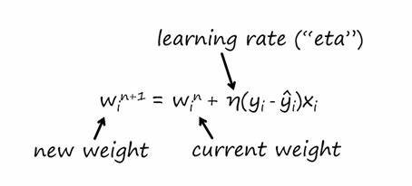

# Introdução aos Perceptrons

Este material faz parte das atividades da disciplina de **Deep Learning** do **Programa de Pós-Graduação em Ciência da Computação (PPGCC)**.

## O que é um Perceptron?

O perceptron é um modelo matemático inspirado no funcionamento dos neurônios biológicos, sendo um dos primeiros algoritmos de aprendizado de máquina desenvolvidos. Ele é a base para redes neurais mais complexas e é utilizado para resolver problemas de classificação linear.

### Estrutura do Perceptron

Um perceptron consiste em:

- **Entradas**: Representam os dados de entrada do modelo.
- **Pesos**: Cada entrada possui um peso associado que determina sua importância.
- **Função de soma**: Calcula a soma ponderada das entradas.
- **Função de ativação**: Aplica uma transformação à soma ponderada para produzir a saída.

### Funcionamento

1. Multiplica-se cada entrada pelo seu peso correspondente.
2. Soma-se os valores ponderados.
3. Aplica-se a função de ativação para determinar a saída final.

O perceptron é capaz de aprender ajustando os pesos com base nos erros cometidos durante o treinamento, utilizando o algoritmo de aprendizado supervisionado.

### Treinamento do Perceptron

O treinamento do perceptron envolve os seguintes passos:

1. **Inicialização dos pesos**: Os pesos são inicializados com valores pequenos ou zeros.
2. **Propagação**: Para cada exemplo de treinamento, calcula-se a saída do perceptron com base nas entradas e nos pesos atuais.
3. **Cálculo do erro**: O erro é a diferença entre a saída esperada e a saída calculada.
4. **Atualização dos pesos**: Os pesos são ajustados utilizando a fórmula:  

5. **Épocas**: O processo é repetido para todos os exemplos de treinamento por um número fixo de épocas ou até que o erro seja minimizado.
6. **Threshold (limiar)**: A função de ativação utiliza um limiar para decidir a saída final (por exemplo, 0 ou 1).

O treinamento é essencial para ajustar os pesos do perceptron, permitindo que ele aprenda a classificar corretamente os dados de entrada.

---

Nos próximos passos, explorarei como implementar um perceptron e entender suas limitações.