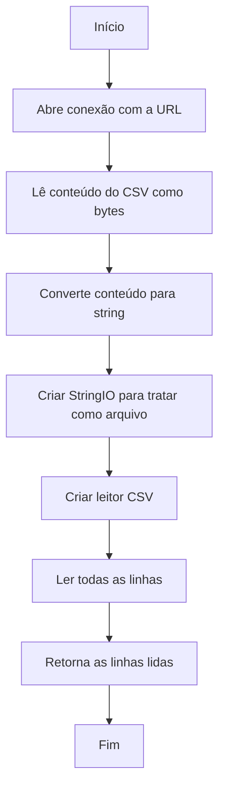

```mermaid
graph TD
    A[Início] --> B[Abre conexão com a URL]
    B --> C[Lê conteúdo do CSV como bytes]
    C --> D[Converte conteúdo para string]
    D --> E[Criar StringIO para tratar como arquivo]
    E --> F[Criar leitor CSV]
    F --> G[Ler todas as linhas]
    G --> H[Retorna as linhas lidas]
    H --> I[Fim]

```
