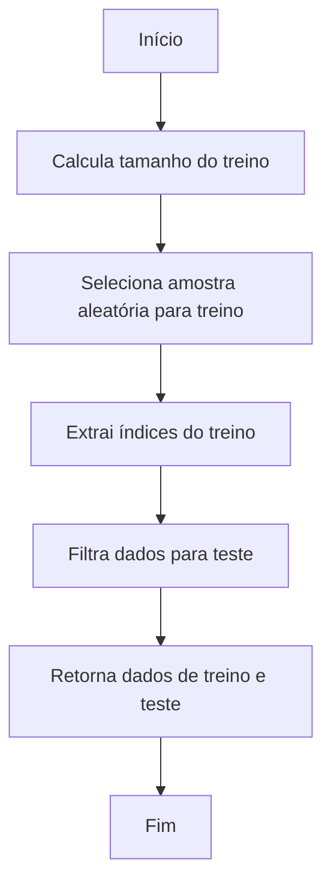

```mermaid
graph TD
    A[Início] --> G[Calcula tamanho do treino]
    G --> H[Seleciona amostra aleatória para treino]
    H --> I[Extrai índices do treino]
    I --> J[Filtra dados para teste]
    J --> K[Retorna dados de treino e teste]
    K --> L[Fim]

```
